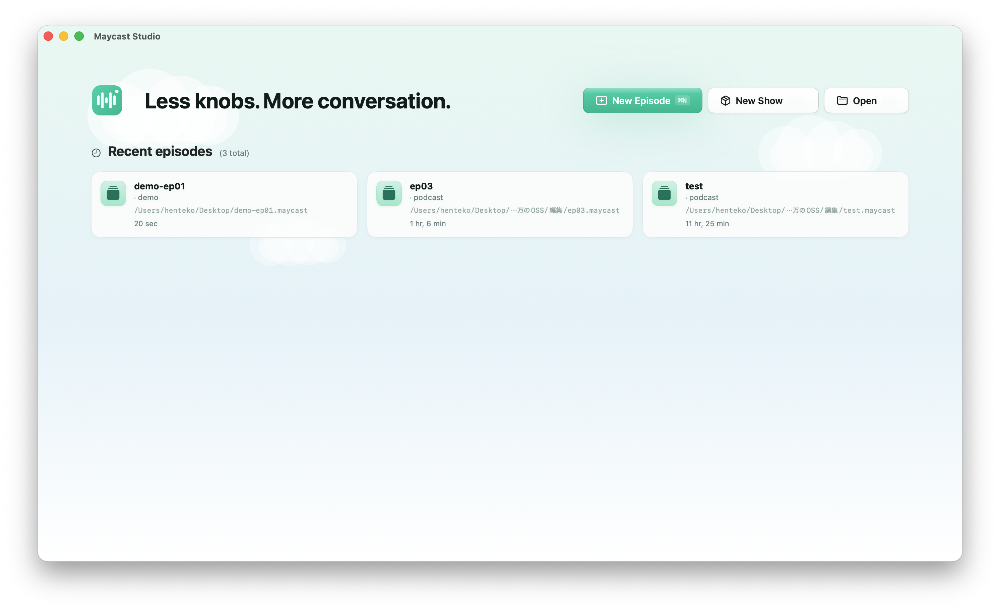
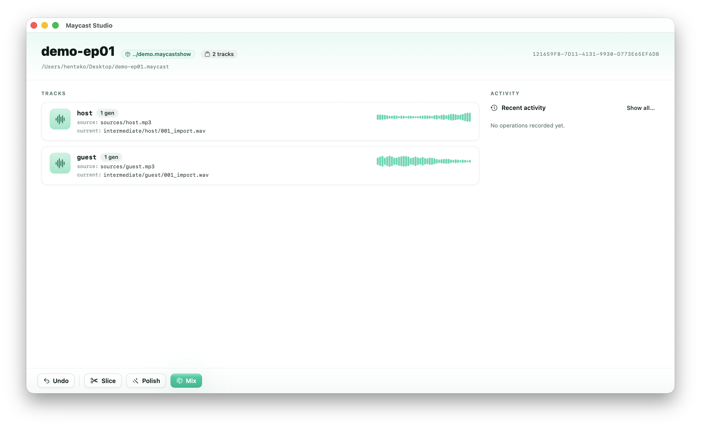
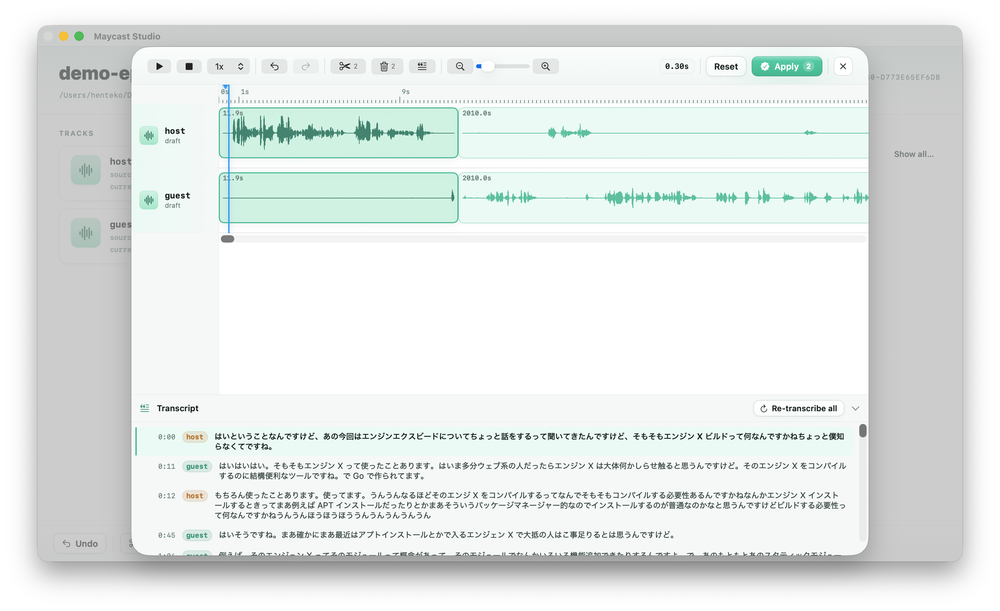
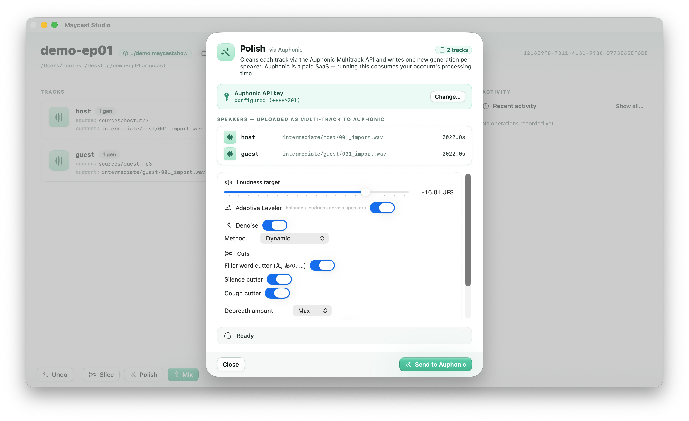
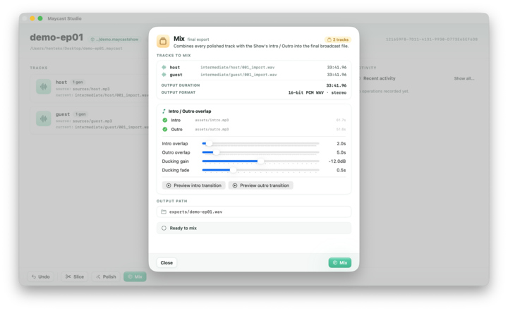

<p align="center">
  
</p>

<h1 align="center">Maycast Studio</h1>

<p align="center">
  The minimum amount of editing, finished. A native macOS podcast editor for the moves you actually make every episode.
</p>

<p align="center">
  
</p>

---

## Concept

> **"The minimum amount of editing, made easy."**

Full-blown DAWs are overkill for podcasting. They demand a steep learning curve and bury the handful of operations you actually perform on every episode — trim silence, clean up the audio, layer in intro/outro/BGM — under thousands of features you'll never touch.

Maycast Studio takes the opposite stance. It focuses on the few essential edits that every podcaster makes every episode, automates the boring parts, and gets you from **raw recording → published episode** along the shortest possible path. No knobs you don't need. No conversation you wouldn't have in plain English with another producer.

## Features

Maycast Studio is organised around three operations that map directly to how podcasts are actually made. Once an episode is open, the toolbar exposes them as **Slice / Polish / Mix** — apply them in any order and any number of times.

<p align="center">
  
</p>

### Slice — Edit

Multi-track audio editing where you can edit by reading the transcript instead of staring at a waveform.

- Per-track **split / delete / move** with non-destructive history
- Edit alongside a **transcript view**, so removing filler words or a flubbed take is a text-level operation
- Quickly identify and cut "ums", retakes, and tangents by what was said, not by where the waveform dips

<p align="center">
  
</p>

### Polish — Clean up

Automatic cleanup of everything that makes raw recordings sound rough.

- **Silence trimming** (threshold-based)
- **Background noise reduction**
- **Loudness normalisation** and gentle compression for consistent levels
- Additional podcast-tuned processing (de-esser, high-pass, …)

<p align="center">
  
</p>

### Mix — Compose

Combine speaker tracks with intro / outro / BGM into a single shippable file.

- Multi-track concatenation
- **Intro / outro / BGM** overlay
- Automatic **ducking** so the BGM gets out of the way under speech
- Per-episode tweaks to the intro/outro overlap region when you want them

<p align="center">
  
</p>

## Install

### Requirements

- macOS 26 (Tahoe) or later

### Download a release (recommended)

Grab the latest prebuilt artefacts from the [GitHub Releases](https://github.com/henteko/maycast-studio/releases) page.

**GUI** — `Maycast-Studio-<version>.dmg`

1. Open the `.dmg`.
2. Drag **Maycast Studio.app** into the `Applications` shortcut inside the disk image.
3. Launch from `/Applications`. On first launch Gatekeeper may prompt you because the build is unsigned — right-click the app and choose **Open** to confirm.

**CLI** — `maycast-<version>-macos-<arch>.tar.gz`

```sh
tar -xzf maycast-*-macos-*.tar.gz
sudo mv maycast /usr/local/bin/        # or anywhere on your $PATH
maycast --help
```

### Build from source (optional)

If you'd rather build everything yourself, you'll need **Xcode 26+** and the bundled Swift 6 toolchain. Clone the repo and use the same `make release` recipe maintainers use to cut official builds:

```sh
git clone https://github.com/henteko/maycast-studio.git
cd maycast-studio
make release           # produces dist/Maycast-Studio-dev.dmg and dist/maycast-dev-macos-<arch>.tar.gz
```

Other useful targets:

```sh
make app               # build only the .app  (output: build/Build/Products/Release/Maycast Studio.app)
make cli               # build only the CLI   (output: .build/release/maycast)
make release-app       # build + package the .dmg only
make release-cli       # build + archive the CLI only
make help              # list every target
```

## How to use

Maycast Studio ships as **two interchangeable front-ends** that share the same XPC-backed processing services. Whatever the GUI does, the CLI can do — and vice versa — so you can drive the same pipeline from a desktop window, a shell script, an E2E test, or an AI agent.

```
┌────────────────────┐    ┌────────────────────┐
│   Maycast Studio   │    │   maycast (CLI)    │
│      (SwiftUI)     │    │                    │
└─────────┬──────────┘    └─────────┬──────────┘
          │   XPC                   │   XPC
          ▼                         ▼
┌─────────────────────────────────────────────┐
│              XPC Services                   │
│   ┌─────────┐  ┌──────────┐  ┌──────────┐   │
│   │  Slice  │  │  Polish  │  │   Mix    │   │
│   └─────────┘  └──────────┘  └──────────┘   │
└─────────────────────────────────────────────┘
```

### GUI

1. Launch **Maycast Studio**.
2. Click **New Episode** to create a `*.maycast` bundle and import speaker tracks. Optionally attach a **Show** that supplies the intro / outro / BGM and per-show defaults.
3. Edit the recording:
   - **Slice** to trim, rearrange, and remove fillers (transcript-assisted).
   - **Polish** to normalise loudness and clean up noise/silence.
   - **Mix** to layer the show's intro / outro / BGM and render the final file.
4. Export the mixed audio from the Mix screen.

Every operation is recorded into the episode bundle's history, so you can rewind, undo, or branch from any past generation without losing the original recording.

### CLI

The `maycast` CLI exposes the same operations for scripting, CI, and AI-agent workflows. (See [Install](#install) for how to build it.)

Day-to-day commands:

```sh
# Create a new Show (intro / outro / BGM live here)
maycast show init ./shows/code-and-coffee.maycastshow

# Attach assets to the Show
maycast show set-asset \
    -show ./shows/code-and-coffee.maycastshow \
    --intro ./assets/intro.wav \
    --outro ./assets/outro.wav \
    --bgm   ./assets/bgm.wav

# Create a new Episode, optionally pre-attaching a Show
maycast init ./episodes/ep01.maycast -show ./shows/code-and-coffee.maycastshow

# Import speaker recordings as tracks
maycast import -project ./episodes/ep01.maycast --as host  ./recordings/host.wav
maycast import -project ./episodes/ep01.maycast --as guest ./recordings/guest.wav

# Transcribe a track (for transcript-assisted slicing later)
maycast transcribe -project ./episodes/ep01.maycast --track host

# Edit clips on a track
maycast slice split  -project ./episodes/ep01.maycast --track host --clip <clip-id> --at 12.5
maycast slice delete -project ./episodes/ep01.maycast --track host --clip <clip-id>
maycast slice move   -project ./episodes/ep01.maycast --track host --clip <clip-id> --to 30.0

# Render the final mix
maycast mix -project ./episodes/ep01.maycast --output exports/ep01.wav

# Inspect / time-travel
maycast list    -project ./episodes/ep01.maycast
maycast inspect -project ./episodes/ep01.maycast --track host
maycast undo    -project ./episodes/ep01.maycast
maycast redo    -project ./episodes/ep01.maycast
```

Run `maycast --help` (or `maycast <subcommand> --help`) for the full option set.

## Releasing

Maintainer workflow for cutting a public release on GitHub.

The release version lives in one place: [`Sources/MaycastCLI/MaycastVersion.swift`](Sources/MaycastCLI/MaycastVersion.swift). `make release` reads that constant and propagates it everywhere — the CLI's `--version` output, the `.app`'s `CFBundleShortVersionString` / `CFBundleVersion`, and the names of the release artefacts.

```sh
# 1. Bump the constant in MaycastVersion.swift, e.g. "dev" → "0.1.0"
$EDITOR Sources/MaycastCLI/MaycastVersion.swift

# 2. Commit and tag
git commit -am "Release v0.1.0"
git tag v0.1.0
git push origin main v0.1.0

# 3. Build the distributable artefacts
make release
# → dist/Maycast-Studio-0.1.0.dmg
# → dist/maycast-0.1.0-macos-arm64.tar.gz

# 4. Create a new GitHub Release from the v0.1.0 tag and attach both files.
```

### One-off labels (RC builds, nightlies)

Override the version for a single invocation without bumping the source constant:

```sh
make release VERSION=0.1.0-rc1
```

Only this build's filenames and embedded metadata are affected; `MaycastVersion.swift` stays untouched, ready for the next real release commit.

## License

Maycast Studio is released under the **Apache License, Version 2.0**. See [`LICENSE`](LICENSE) for the full text.

Copyright © 2026 henteko.
